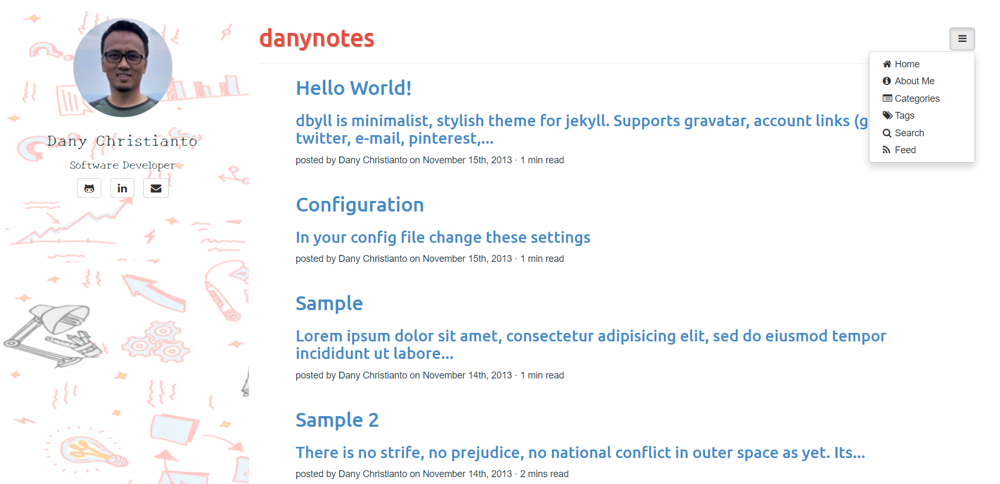

## Reference
This theme forked from https://github.com/dbtek/dbyll and add a little modification

### Features
- Responsive layout.
- Supports tags and categories.
- Social profile and bio of author.
- Bootstrap based.
- Glyphicon and Font-Awesome Icons.
- Pagination.
- Syntax highlighting with pygments.
- Disqus comments.
- :new: Custom sidebar background image.
- Read duration
- Search post

### Install
- You need to have [ruby](https://www.ruby-lang.org/en/documentation/installation/) installed in your system.
- Install bundler which helps in specifying and installing dependencies of any Ruby project. ```gem install bundler```
- Go to the root of the repo and run this - ```bundle install```
- Then - ```bundle exec jekyll serve```

### Screenshots


### License
- [MIT](http://opensource.org/licenses/MIT)
