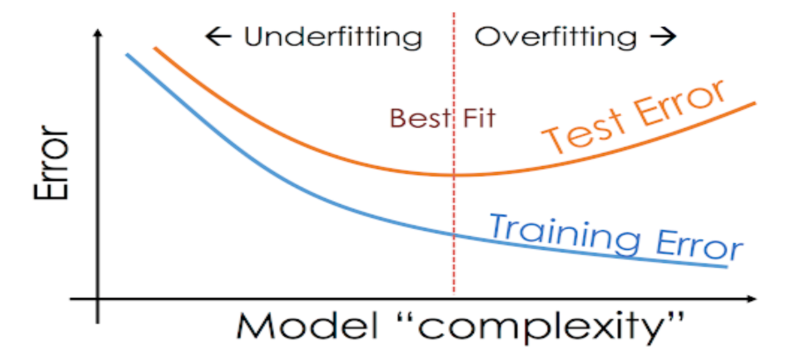

Dalam membuat model machine learning sering kali terjadi model yang dibuat menunjutkan hasil anomaly ***Overfitting*** atau ***Underfitting***

## Overfitting ##

Overfitting adalah kondisi dimana model yang dibuat hampir sempurna kecocokanya dengan data ***training*** atau fokus model hanya pada ***training*** data tertentu, tetapi tidak valid dalam validasi dengan test dataset atau data baru lainnya.

## Underfitting ##

Underfitting adalah kondisi dimana model gagal menangkap perbedaan pola penting dalam ***training*** dataset, sehingga tidak bisa melakukan prediksi dengan tepat dalam test dataset.

Grafik berikut menggambarkan ***Underfitting*** dan ***Overfitting***



## Mengatasi Underfitting atau Overfitting ##

Untuk mengontrol terjadinya anomaly ***underfitting*** atau ***overfitting*** sehingga didapat akurasi model dilakukan dengan cara menentukan argumen max_nodes atau titik terendah dari test error.   

```python 
import pandas as pd
from sklearn.metrics import mean_absolute_error
from sklearn.model_selection import train_test_split
from sklearn.tree import DecisionTreeRegressor


# read file

file_path='train.csv'
home_data = pd.read_csv(file_path)

# create target object and call it "y"
y = home_data.SalePrice
print(home_data.SalePrice)

# create X
features = ['LotArea', 'YearBuilt', '1stFlrSF','2ndFlrSF', 'FullBath', 'BedroomAbvGr', 'TotRmsAbvGrd']

X = home_data[features]

# Split into validation and training data
train_X, val_X, train_y, val_y = train_test_split(X, y, random_state=1)

# Specify Model
iowa_model = DecisionTreeRegressor(random_state=1)

# Fit Model
iowa_model.fit(train_X, train_y)

# Make validation predictions and calculate absolute error
val_predictions = iowa_model.predict(val_X)
val_mae = mean_absolute_error(val_predictions, val_y)

print("Validation MAE:{:,.0f}".format(val_mae))


# create function to compare the accuracy of models built with different values for max_leaf_nodes

def get_mae(max_leaf_nodes, train_X, val_X, train_y, val_y):
    model = DecisionTreeRegressor(max_leaf_nodes=max_leaf_nodes, random_state=0)
    model.fit(train_X, train_y)
    prediction_val = model.predict(val_X)
    mae = mean_absolute_error(val_y, prediction_val)

    return(mae)

# step 1 compare different tree sizes
candidate_max_leaf_nodes = [5, 25, 50, 100, 250, 500]

# write loop to find the ideal tree size
scores = {leaf_size: get_mae(leaf_size, train_X, val_X, train_y, val_y) for leaf_size in candidate_max_leaf_nodes}

# store the best value of max_leaf_node / titik terendah dari test error
best_tree_size = min(scores, key=scores.get)

print("Best Tree Size:{:,.0f}".format(best_tree_size))

# step 2 Fit model using all data
# Setelah mendapat titik terbaik untuk mengontrol underfitting atau overfitting,
# selanjutnya terapkan best_tree_size pada model dengan menggunakan semua data.

final_model = DecisionTreeRegressor(max_leaf_nodes=best_tree_size, random_state=1)

final_model.fit(X, y)

final_val_predictions = final_model.predict(val_X)
final_val_mae = mean_absolute_error(final_val_predictions, val_y)


print("Max leaf nodes: %d  \t Mean Absolute Error: %d" %(best_tree_size, final_val_mae))

```


